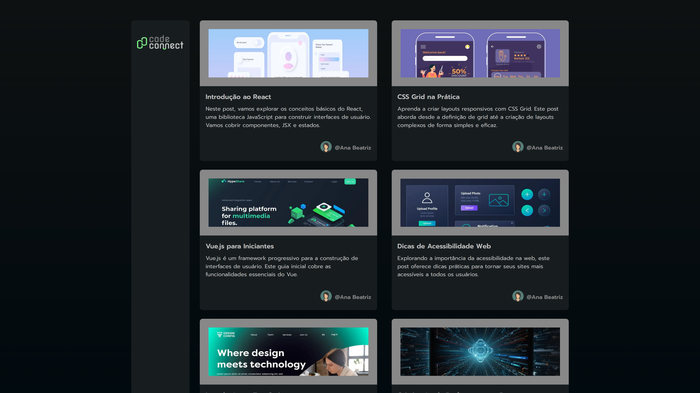

# Code Connect

## 📖 Descrição

O **Code Connect** é uma aplicação simples desenvolvida com Next.js 14 que simula uma plataforma de blog com conteúdo para desenvolvedores. O projeto foi criado como parte do curso de formação em Next.js da Alura.



## 🛠️ Tecnologias

- Next.js 14
- React 18
- CSS Modules
- Remark (markdown)
- DOMPurify
- Winston (logging)
- JSON Server

## 🚀 Como Executar

1. **Instale as dependências**

   ```bash
   yarn install
   ```

2. **Inicie o servidor de dados**

   ```bash
   yarn server
   ```

3. **Inicie o servidor de desenvolvimento**

   ```bash
   yarn dev
   ```

4. **Acesse** [http://localhost:3000](http://localhost:3000)
